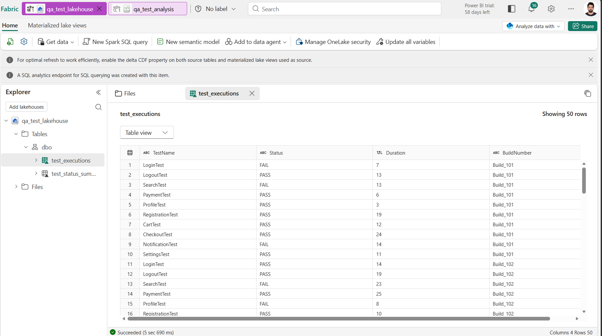
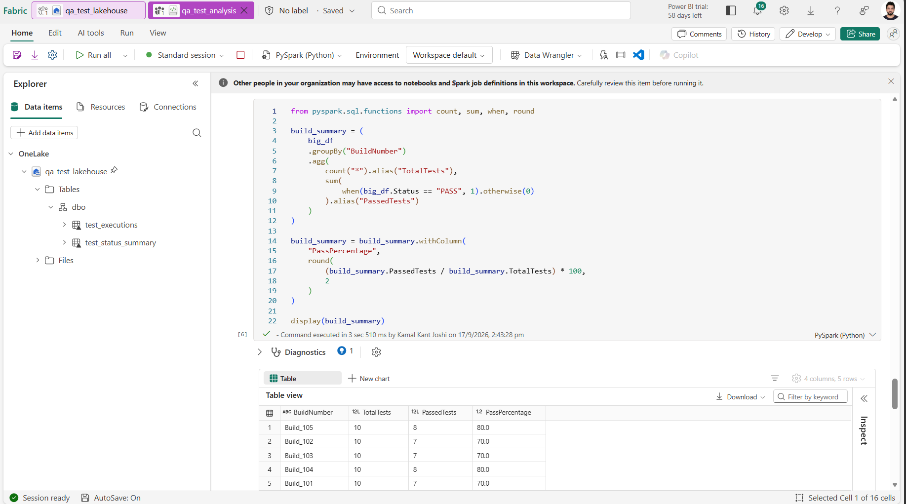
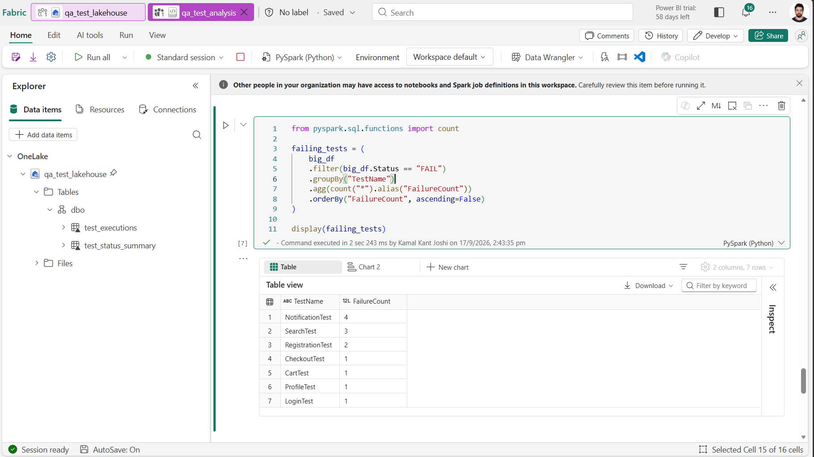
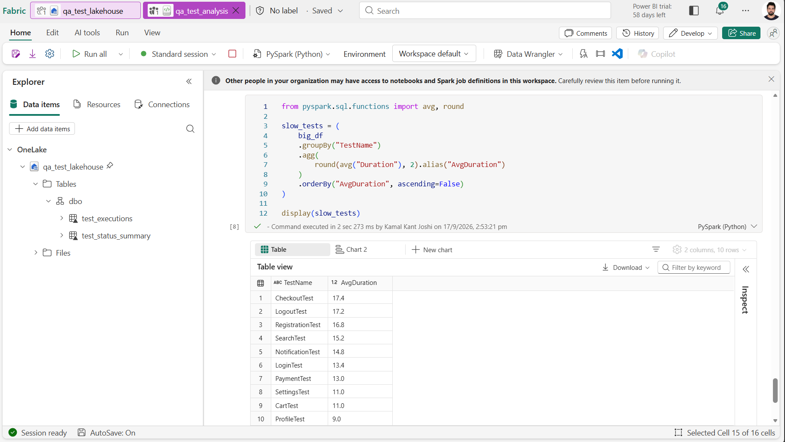

# QA Test Analytics using Microsoft Fabric & PySpark

## Overview

This project demonstrates how Microsoft Fabric and PySpark can be used to analyze QA automation test execution results.

The solution loads test execution data into a Fabric Lakehouse, performs data analysis using PySpark, and generates visual insights to help identify quality trends.

---

## Technology Stack

- Microsoft Fabric
- Lakehouse
- PySpark
- SQL
- Data Visualization

---

## Project Assets

- PySpark Notebook: `qa_test_analytics.ipynb`
- Microsoft Fabric Lakehouse
- Analytics Visualizations
- Sample QA Test Execution Dataset
- Lakehouse Tables

---

## Architecture

```text
Test Results CSV
        ↓
Fabric Lakehouse
        ↓
PySpark Notebook
        ↓
Data Transformations
        ↓
Build Quality Analysis
        ↓
Top Failing Tests Analysis
        ↓
Slowest Tests Analysis
        ↓
Lakehouse Tables
        ↓
Charts & Visualizations
```

---

## Analytics Implemented

### 1. Build-wise Pass Percentage

Calculates the pass percentage for each build to assess build quality and identify stable builds.

### 2. Top Failing Tests

Identifies the test cases contributing the highest number of failures, helping teams prioritize investigation efforts.

### 3. Slowest Tests Analysis

Highlights test cases with the highest average execution duration to identify execution bottlenecks.

---

## Key Fabric Concepts Used

- Workspace
- Lakehouse
- Notebooks
- Files
- Tables
- Data Visualization
- Data Storage and Management

---

## Key PySpark Concepts Used

- DataFrames
- Data Ingestion
- Filtering
- Aggregations
- GroupBy Operations
- Calculated Metrics
- Data Persistence
- Table Creation

---

## Skills Demonstrated

- Microsoft Fabric
- PySpark
- Data Engineering Fundamentals
- Data Analysis
- Data Visualization
- SQL
- ETL Concepts
- Lakehouse Architecture
- KPI Calculation
- Analytical Reporting
- QA Metrics Analysis
- Troubleshooting and Data Validation

---

## Sample Insights

- Build quality trends
- Pass percentage by build
- Failure hotspots
- Execution bottlenecks
- Test stability monitoring
- Identification of high-risk test cases

---

## Learning Outcomes

Through this project I gained hands-on experience with:

- Microsoft Fabric Lakehouse
- PySpark Data Processing
- Data Visualization
- QA Analytics
- SQL-based Data Exploration
- Table Management
- Data Aggregation Techniques
- Analytical Dashboard Development

---
## Screenshots

### Lakehouse



The Microsoft Fabric Lakehouse used to store raw files and processed tables.

---

### Build-wise Pass Percentage Analysis



Build quality analysis showing total tests, passed tests, and pass percentage for each build.

---

### Top Failing Tests



Analysis of test cases with the highest number of failures, helping identify failure hotspots.

---

### Slowest Tests Analysis



Average execution duration analysis used to identify test execution bottlenecks and optimization opportunities.

---
## Project Workflow

1. Upload QA test execution data into Microsoft Fabric Lakehouse.
2. Read the data using PySpark DataFrames.
3. Perform data transformations and aggregations.
4. Calculate build-level quality KPIs.
5. Identify top failing tests.
6. Analyze average test execution duration.
7. Save processed datasets as Lakehouse tables.
8. Generate visualizations for reporting and analysis.

---

## Future Enhancements

- Flaky Test Detection
- Automated Data Pipelines
- Power BI Dashboard Integration
- Historical Trend Analysis
- Defect Analytics Integration
- Real-time Test Execution Monitoring
- CI/CD Analytics Integration

---

## Conclusion

This project demonstrates an end-to-end QA analytics workflow using Microsoft Fabric and PySpark. The solution showcases how test execution data can be transformed into actionable insights that help engineering teams monitor quality, identify failure hotspots, and optimize test execution performance.
